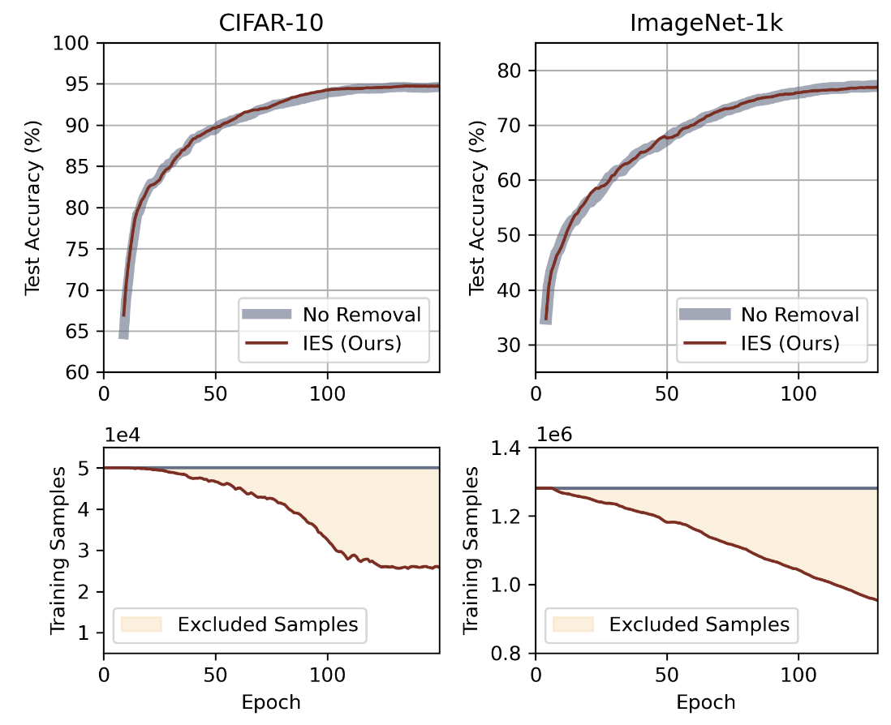

<h2 align="center">Instance-dependent Early Stopping</h2>
<p align="center"><b>ICLR 2025 Poster</b> | <a href="https://openreview.net/pdf?id=P42DbV2nuV">[Paper]</a> | <a href="https://github.com/tmllab/2025_ICLR_IES">[Code]</a> </p>
<p align="center"> <a href="https://suqinyuan.github.io">Suqin Yuan</a>, <a href="https://runqilin.github.io">Runqi Lin</a>,  <a href="https://lfeng1995.github.io">Lei Feng</a>, <a href="https://bhanml.github.io">Bo Han</a>, <a href="https://tongliang-liu.github.io">Tongliang Liu</a> </p>

### TL;DR
IES (Instance-dependent Early Stopping) advances the concept of early stopping by applying it at the individual instance level, achieving training speedup without compromising model performance.

<br>
<div style="display: flex; align-items: flex-start;">
  <div style="flex: 0 0 28%; margin-right: 20px;">
    
  </div>
  <div style="flex: 1;">
    <p>
      Effectiveness of Instance-dependent Early Stopping (IES) on ImageNet-1k and CIFAR-10 datasets.
      <br>      
      Top row: Test accuracy over the course of training, showing that IES (Ours) achieves comparable accuracy to the baseline (No Removal) despite training on fewer samples.
      <br>
      Bottom row: Number of training samples excluded from backpropagation by IES over the course of training. As the model masters more and more samples during the training process, IES allows an increasing number of these <em>mastered</em> samples to be excluded from backpropagation, significantly reducing computation while still maintaining the same performance as the baseline method.
    </p>
  </div>
</div>

### BibTeX
```bibtex
@inproceedings{
yuan2025instancedependent,
title={Instance-dependent Early Stopping},
author={Suqin Yuan and Runqi Lin and Lei Feng and Bo Han and Tongliang Liu},
booktitle={The Thirteenth International Conference on Learning Representations},
year={2025}
}
```

### Experiments
You should put the [CIFAR datasets](https://www.cs.toronto.edu/~kriz/cifar.html) in the folder `.\cifar-10` and `.\cifar-100` when you have downloaded them.

To run the CIFAR-10 example with IES, run the following:
```bash
python3 cifar_main.py --dataset cifar10 --model resnet18
```

To run the CIFAR-100 example with IES, run the following:
```bash
python3 cifar_main.py --dataset cifar100 --model resnet34
```

To run the examples with baseline, add `--threshold 0`.

The training efficiency can be further improved by adjusting the `--threshold` parameter. We set the default base threshold to `1e-3`, and recommend tuning it between `1e-1` and `1e-5` to achieve different trade-offs between training speed and model performance.